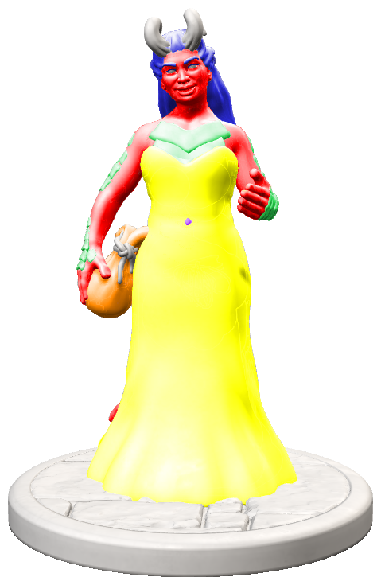

# Ea
Tiefling  (Draconic) Sorcerer\

## The beginning
Ea is born in one of the slums of Neverwinter. At the age of 2, she began showing some more advanced magic than the usual tiefling magic. One example is that some flies and other insects usually got electrocuted whenever Ea got her hands on them.

A couple years later her parents were done with all these inconveniences, especially as some of them did come with some expensive repairs which made it very difficult for them. This is how she got on the streets, alone, at the age of 5.

## The silvered gold
After some weeks of being alone, some members of *The silvered gold* (A trader's guild known for the slogan ***You wish you met us earlier***) witnessed one of her attempts to become friends with a dove (a combination of Thaumaturgy and Friends) that didn't work out that well.

Even though the magic didn't work out, the traders knew that with some training, this kind of magic could be useful. Not knowing where else to go, and happy to be off the streets, the young girl accepted their proposal to join and learn from them.

During the following years, Ea became better and more reliable using her magic, together with the tricks of trading. It surprised a lot of people that she managed to get better than most of her tutors (most of which would've rather have her stay in their group than let her go her own way). Year after Year she got a little more respect and trust from her guild, until she one day (about 2 years ago) got a cart to seek out deals on her own.

## Thokk
One day, while traveling in between villages, she got raided by some goblins, even though she was sure she'd be able to handle them herself, she was pleasantly surprised when a half-orc monk appeared at the edge of the forest. It was Thokk, a monk living in this forest who came towards the sound of the yelling goblins.
A simple meal later they both went there own ways. From the many raids Ea came across, on her own or in training, she always remembered this one. Thokk left a memory she can't lose, she noticed him not having anything valuable, with clothes old and worn out. She is now collecting coin as best as she can, hoping to someday come across Thokk again, and be able to win him over with a luxurious life for them together.

## The adventure begins
While traveling trough the lands, she came across Phandalin, where she thought to get some quick rewards from a simple looking quest ont he board, and maybe even do some trading along the way as well!
Little did she know about the events that would arise from taking this decision...

[This file](extended%20information) contains more in depth questions.
